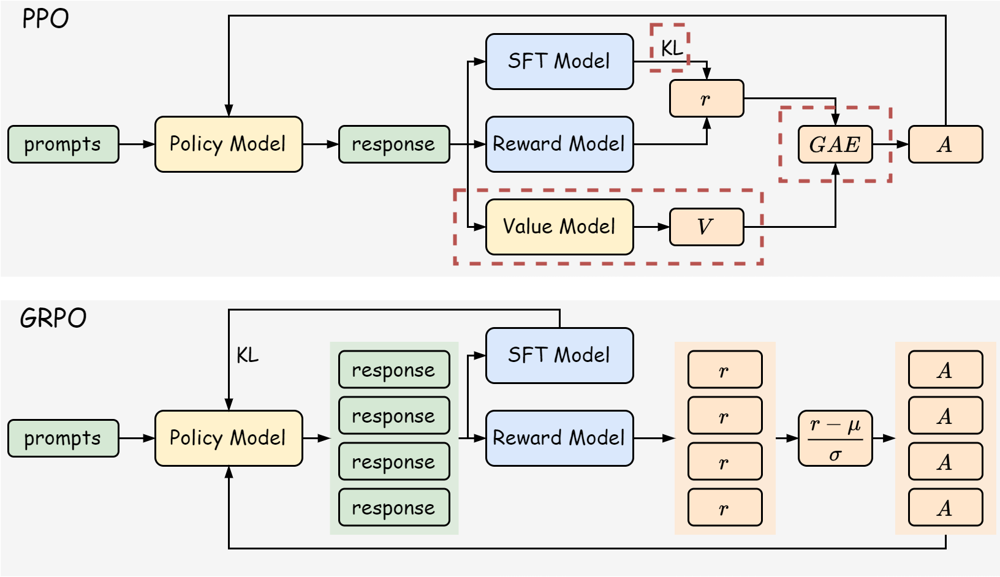
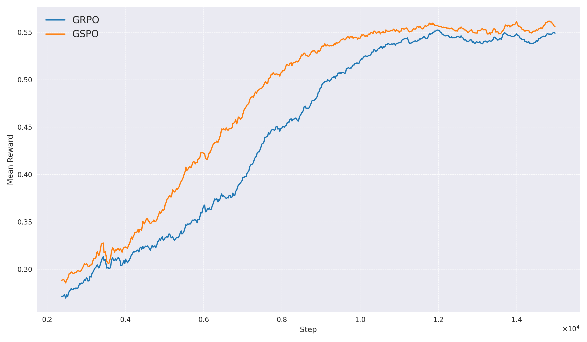
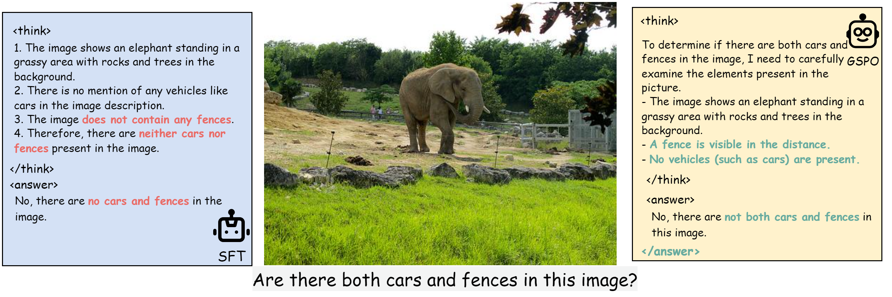

# Reinforced Fine-tuning for Visual Language Chain-of-Thought
One way to enhance the reasoning capability of LLMs is to guide the model to output Chain-of-Thought (CoT) before giving the final answer. This project seeks to stimulate the generation of high-quality CoTs by using reinforced fine-tuning method such as Group Relative Policy Optimization (GRPO), for Visual Language Models under the task of visual question answering. We provide a dataset containing 5k high-quality CoTs, built upon [GQA](https://arxiv.org/abs/1902.09506). Scripts for Supervised Fine-Tuning is provided, as well as the LoRA adapters after SFT training. We further conduct reinforced fine-tuning, specifically GRPO and [Group Sequence Policy Optimization (GSPO)](https://arxiv.org/abs/2507.18071), utilizing reward design to enhance the consistency of CoTs. Checkpoint after GSPO training is provided to facilitate further research.
## Usage Guide
1. [Installation](docs/installation.md)
2. [Training](docs/train.md)
3. [Evaluation](docs/evaluation.md)
## Project Description

Group Relative Policy Optimization (GRPO) uses the normalized reward as token-level advantage estimation. This formulation made it possible to get rid of the value model (shown in the above figure). GSPO further proposes that, the dimension of reward should match the dimension of optimization objective. In this project, we design rule based reward functions covering three parts: format, correctness and **CoT consistency**. Details can be found in [reward function](reinforced_cot/finetune/grpo/reward.py). The reward curve for GRPO and GSPO are shown below, and supports the claim in GSPO paper that **consistent optimization objective and reward function promotes faster convergence**.

Furthermore the quantitative result show the improvement of answer accuracy and CoT consistency after reinforcement learning.
| Model | Answer Accuracy | CoT Consistency |
|:----:|:------:|:------:|
| SFT  | 0.5620 | 0.8402 |
| GRPO | 0.7820 | 0.9437 |
| GSPO | **0.8480** |**0.9575** |

The qualitative results for one example image in GQA:

Which confirms the role of format and consistency reward. All in all, we found that after GRPO training, the model became more formal and consistent on the GQA dataset. The code is made open-source to promote further research on enhancing the quality of CoTs and inspire more methods on reinforcement learning for auto-regressive models.